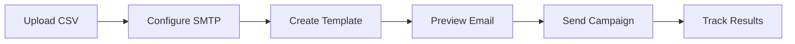
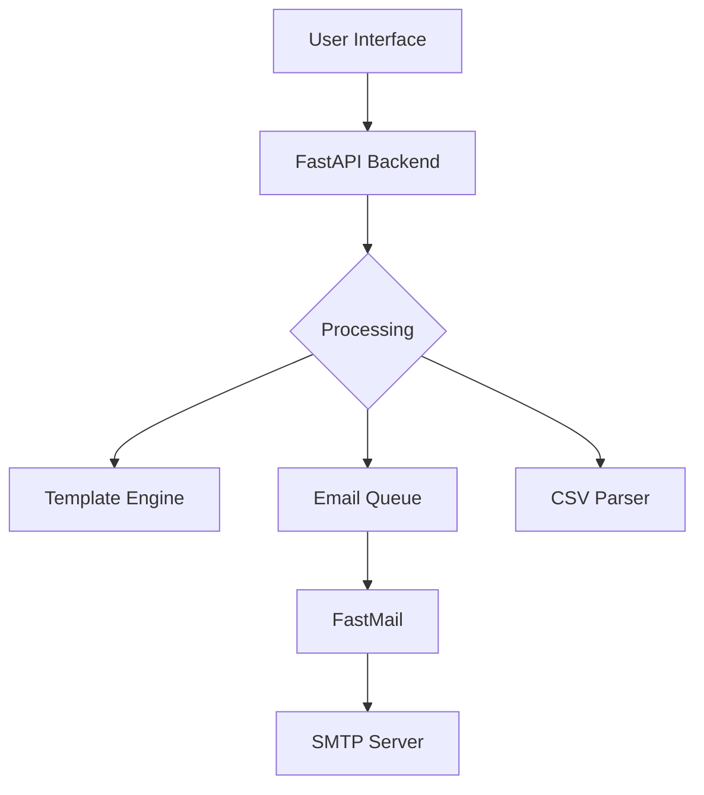

<div align="center">


[](https://fastapi.tiangolo.com)
[](https://fastmail.com)
[](https://jinja.palletsprojects.com/)

> 📧 Transform your email campaigns with powerful mass mailing capabilities!

<p align="center">
  <a href="#features">Features</a> •
  <a href="#prerequisites">Prerequisites</a> •
  <a href="#installation">Installation</a> •
  <a href="#deployment">Deployment</a> •
  <a href="#usage">Usage</a>
</p>

<p align="center">
 Streamlined mass mailing
 Rich HTML templates
 Delivery analytics
</p>

</div>

## ✨ Features

<details>
<summary>📧 Email Management</summary>

- **Advanced HTML Editor**
  - Rich text formatting
  - Template customization
  - Dynamic content insertion
  - Real-time preview
- **Recipient Management**
  - CSV file upload support
  - Contact list organization
  - Dynamic field mapping
  - Duplicate detection
- **Campaign Tools**
  - Scheduled sending
  - Batch processing
  - Personalization tokens
  - Template variables

</details>

<details>
<summary>🔧 System Features</summary>

- **SMTP Configuration**
  - Multiple provider support
  - Secure connection handling
  - Custom port configuration
  - Authentication management
- **Error Handling**
  - Comprehensive logging
  - Retry mechanisms
  - Failure notifications
  - Invalid email detection
- **Performance**
  - Asynchronous processing
  - Rate limiting
  - Queue management
  - Resource optimization

</details>

<details>
<summary>📊 Analytics & Reporting</summary>

- **Delivery Tracking**
  - Success/failure rates
  - Bounce tracking
  - Delivery timestamps
  - Error categorization
- **Campaign Insights**
  - Batch statistics
  - Processing times
  - Queue status
  - System performance

</details>

## 🚀 Getting Started



### 📋 Prerequisites

<table align="center">
  <tr>
    <td align="center" width="96">
      
      <br>Python 3.8+
    </td>
    <td align="center" width="96">
      
      <br>FastAPI
    </td>
    <td align="center" width="96">
      
      <br>Jinja2
    </td>
  </tr>
</table>

### 🛠️ Installation

1️⃣ **Clone the Repository**
```bash
git clone https://github.com/lohitkolluri/FlaskPost.git
cd FlaskPost
```

2️⃣ **Set Up Environment**
```bash
python -m venv venv
source venv/bin/activate  # Windows: venv\Scripts\activate
```

3️⃣ **Install Dependencies**
```bash
pip install -r requirements.txt
```

4️⃣ **Launch the Application**
```bash
python app.py
```

The application will be available at `http://localhost:5000`

## 💻 Usage

### 📤 Sending Emails

1. Access the web interface at `http://localhost:5000`
2. Configure your SMTP settings in the web UI:
   - SMTP Host (e.g., smtp.gmail.com)
   - SMTP Port (e.g., 587 for TLS)
   - Username and Password
   - TLS/SSL preferences
3. Upload your CSV file with recipient data
4. Create or select an HTML email template
5. Preview your email
6. Send your campaign

Your SMTP settings are securely stored for the session and can be easily modified through the interface.

### 📝 Template Variables

```html
Dear {{recipient_name}},

Your custom message here.

Best regards,
{{sender_name}}
```

### 🔍 CSV Format

```csv
email,name,custom_field
john@example.com,John Doe,Value1
jane@example.com,Jane Smith,Value2
```

## 🛡️ Security Features

- **Email Validation**
  - Syntax checking
  - Domain verification
  - Bounce detection
- **Data Protection**
  - Secure SMTP
  - Environment variables
  - Data encryption
- **Error Prevention**
  - Rate limiting
  - Duplicate detection
  - Format validation

## 📊 System Architecture



## 🔧 Configuration

<details>
<summary>Web UI Configuration</summary>

The application provides a user-friendly interface for configuring:

- **SMTP Settings**
  - Server host and port
  - Authentication credentials
  - Security options (TLS/SSL)
  - Connection testing
- **Email Options**
  - Sender name and email
  - Reply-to address
  - Custom headers
  - Rate limiting
- **Template Settings**
  - HTML editor configuration
  - Preview options
  - Variable mapping
</details>

## 📄 License

<div align="center">

MIT License © [Lohit Kolluri](LICENSE) - feel free to use this project as you wish!


</div>
